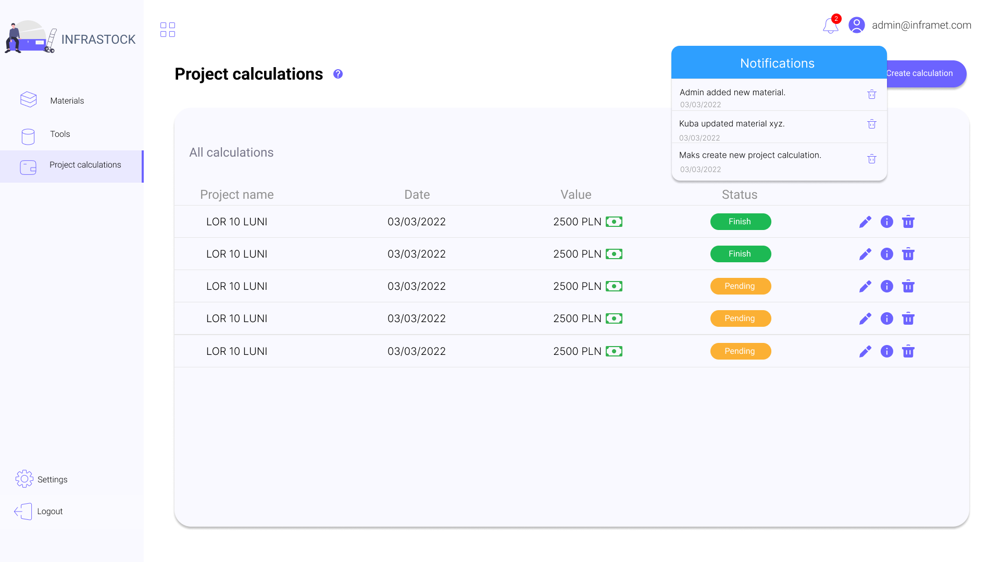
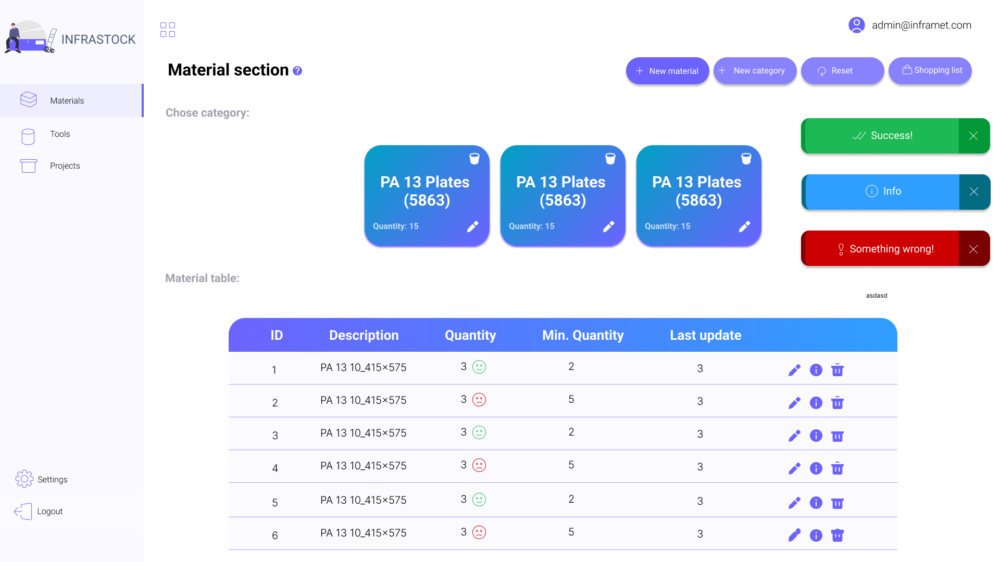

# Infrastock
> Application for managing the inventory of materials / tools in the company.

## Table of Contents
* [General Info](#general-information)
* [Technologies Used](#technologies-used)
* [Features](#features)
* [Screenshots](#screenshots)
* [Setup](#setup)
* [Project Status](#project-status)
<!-- * [License](#license) -->

## General Information
- This project is a fullstack application, thanks to which the user can quickly control and manage the inventory of tools and materials in the company. In addition to the CRUD functionality for materials and tools, the user also has the option of making a cost estimate for a given project, taking into account material costs.
- The aim of the project was to create a solution thanks to which employees will be able to check stock shortages and, if necessary, quickly respond to them.

## Technologies Used
- Java - version 11
- Spring Boot - version 2.6.3
- MySQL - version 5.7
- JavaScript - ECMAScript 6
- HTML - version 5
- CSS - version 3

## Features
List the ready features here:
- Login/logout
- Registration
- CRUD for materials
- CRUD for tools
- CRUD for calculations

## Screenshots

<!-- If you have screenshots you'd like to share, include them here. -->

## Setup
To run the project locally, you need to have docker installed. Then download the docker-compose.yml file from github https://github.com/jakubczubak/InfraStock/tree/master/docker-compose.
Place the docker-compose.yml file in any folder on the disk.
Then run console and enter the command:

`docker-compose up`

wait for the installation process to complete

check the address in the browser `http://localhost:9090/`

login: `jczu@inframet.com`

password: `kuba`

## Project Status
Project is: _in progress_ 

